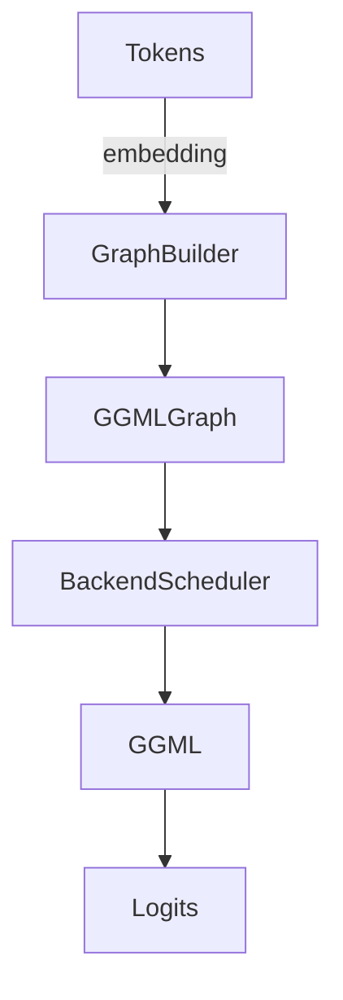
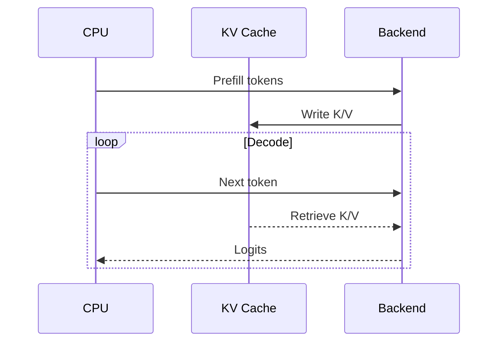
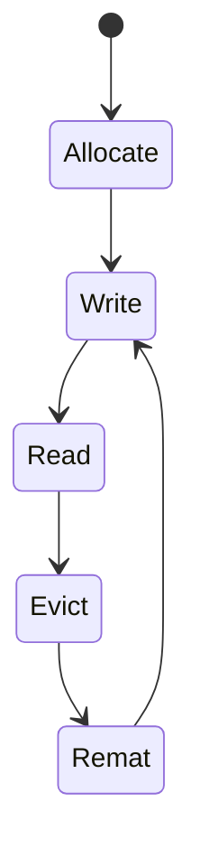

# Repository Codex
- **Repo:** llama.cpp  • **Commit:** c247d06f • **Generated:** 2025-08-25 UTC

## 1) High-level Overview
llama.cpp is a C/C++ inference engine for large language models built on top of the ggml tensor library. The repo contains the core runtime, model loaders, kv-cache implementations, and multiple backend integrations (CUDA, Metal, HIP, SYCL, Vulkan, etc.) for executing GGML graphs on various hardware.

```mermaid
flowchart LR
  CLI/Server --> Core(Tokenizer/Graph/Context)
  Core --> GGML
  GGML -->|Backend flags| {CPU|CUDA|Metal|HIP|SYCL|Vulkan|MUSA|CANN|WebGPU|zDNN|OpenCL}
  Core --> KVCache[XQuant/Quantized KV]
  KVCache --> Storage/Remat
```

## 2) Directory Map
- **src/** – core library: context, graph builder, kv-cache, model loader, sampler, etc.
- **include/** – public headers exposing the C API and C++ wrapper.
- **ggml/** – tensor core and backend implementations (CUDA, Metal, HIP, SYCL, Vulkan, etc.).
- **common/** – shared utilities: argument parsing, sampling, logging, ngram cache.
- **tools/** – CLI programs (main run, quantize, server, benchmarks).
- **docs/** – build instructions and backend guides.
- **scripts/** – helper scripts for building, tests, dataset downloads.
- **ci/** – minimal CI harness.

## 3) Build & Backends
CMake is the primary build system. The top-level `CMakeLists.txt` sets options for warnings, sanitizers, and optional components like tests or examples【F:CMakeLists.txt†L34-L88】. `src/CMakeLists.txt` defines the `llama` library and links it against `ggml`【F:src/CMakeLists.txt†L9-L44】. The Makefile merely redirects users to CMake【F:Makefile†L1-L8】.

`CMakePresets.json` supplies ready-made configurations (e.g., `GGML_SYCL=ON`, `GGML_VULKAN=ON`) for different platforms【F:CMakePresets.json†L5-L64】.

The ggml build script enumerates backend toggles and adds backend subdirectories via `ggml_add_backend()`【F:ggml/src/CMakeLists.txt†L309-L386】.

### Backend Table
| Backend | Flag(s)/Option(s) | Key Files/Dirs | Notes |
|---------|------------------|----------------|-------|
| CPU | default (`ggml_add_backend(CPU)`) | ggml/src/ggml.c, ggml/src/ggml-cpu/* | baseline backend【F:ggml/src/CMakeLists.txt†L309-L373】 |
| CUDA | `GGML_CUDA=ON` | ggml/src/ggml-cuda/* | Flags like `GGML_CUDA_USE_GRAPHS`, `GGML_CUDA_FA_ALL_QUANTS`, etc., defined in CUDA CMake【F:ggml/src/ggml-cuda/CMakeLists.txt†L48-L90】 |
| Metal | `GGML_METAL=ON` | ggml/src/ggml-metal/* | macOS backend【F:ggml/CMakeLists.txt†L157-L168】【F:ggml/src/CMakeLists.txt†L377-L380】 |
| HIP | `GGML_HIP=ON` | ggml/src/ggml-hip/* | AMD GPUs【F:ggml/CMakeLists.txt†L157-L166】【F:ggml/src/CMakeLists.txt†L377-L378】 |
| SYCL | `GGML_SYCL=ON` | ggml/src/ggml-sycl/* | Intel & other SYCL devices【F:ggml/CMakeLists.txt†L147-L168】【F:ggml/src/CMakeLists.txt†L381-L382】 |
| Vulkan | `GGML_VULKAN=ON` | ggml/src/ggml-vulkan/* | GPU-agnostic Vulkan backend【F:CMakePresets.json†L31-L32】【F:ggml/src/CMakeLists.txt†L383】 |
| MUSA | `GGML_MUSA=ON` | ggml/src/ggml-musa/* | Chinese MUSA GPUs【F:ggml/src/CMakeLists.txt†L380】 |
| CANN | `GGML_CANN=ON` | ggml/src/ggml-cann/* | Huawei Ascend NPU【F:ggml/src/CMakeLists.txt†L376】 |
| WebGPU | `GGML_WEBGPU=ON` | ggml/src/ggml-webgpu/* | Browser/backend experiments【F:ggml/src/CMakeLists.txt†L384】 |
| zDNN | `GGML_ZDNN=ON` | ggml/src/ggml-zdnn/* | IBM z Systems【F:ggml/src/CMakeLists.txt†L385】 |
| OpenCL | `GGML_OPENCL=ON` | ggml/src/ggml-opencl/* | Generic OpenCL path【F:ggml/src/CMakeLists.txt†L386】 |

Backend libraries are compiled via `ggml_add_backend_library` and linked into `ggml` or built as loadable modules when `GGML_BACKEND_DL` is enabled【F:ggml/src/CMakeLists.txt†L230-L267】.

## 4) File-by-File Index (selected)
### src/
| Path | Purpose & Key Functions |
|------|------------------------|
| `src/llama.cpp` | Core API implementation: initialization, model loading, system info. Key functions: `llama_backend_init`【F:src/llama.cpp†L57-L66】, `llama_model_load` (loads model tensors)【F:src/llama.cpp†L86-L119】. |
| `src/llama-context.cpp` | Runtime state for inference; synchronizes backend scheduler and tracks stats. Functions: `llama_context::~llama_context`【F:src/llama-context.cpp†L363-L366】, `llama_context::synchronize`【F:src/llama-context.cpp†L367-L395】. |
| `src/llama-kv-cache.cpp` | KV-cache allocator and manipulation. Functions: constructor `llama_kv_cache::llama_kv_cache`【F:src/llama-kv-cache.cpp†L19-L55】, `clear`【F:src/llama-kv-cache.cpp†L214-L226】, `seq_rm`【F:src/llama-kv-cache.cpp†L227-L289】. |
| `src/llama-graph.cpp` | Builds ggml computation graphs; `llm_graph_input_embd::set_input` configures embedding inputs【F:src/llama-graph.cpp†L16-L23】. |
| `src/llama-quant.cpp` | Quantization helpers and formats. |
| `src/llama-sampling.cpp` | Sampling strategies for token generation. |
| `src/llama-model-loader.cpp` | GGUF model loading routines. |

### include/
- `include/llama.h` – public C API: enums for vocab types, rope types, token attributes【F:include/llama.h†L71-L111】.
- `include/llama-cpp.h` – C++ convenience wrappers (header-only).

### ggml/
- `ggml/src/ggml.c` – tensor core, operators, memory and graph execution【F:ggml/src/ggml.c†L214-L214】.
- `ggml/src/ggml-cuda/ggml-cuda.cu` – CUDA backend kernels and scheduler integration; environment toggles like `GGML_CUDA_DISABLE_GRAPHS` appear here【4470b4†L1087-L1150】.
- `ggml/src/ggml-metal/ggml-metal.m` – Metal shader invocation.
- `ggml/src/ggml-sycl/ggml-sycl.cpp` – SYCL backend.

### common/
- `common/arg.cpp` – argument parsing DSL; supports loading from environment variables via `common_arg::set_env`【F:common/arg.cpp†L78-L103】.
- `common/common.cpp` – utilities incl. cache directory selection respecting `LLAMA_CACHE`【F:common/common.cpp†L852-L879】.

### tools/
- `tools/run/run.cpp` – interactive CLI; reads `LLAMA_PROMPT_PREFIX` for prompt prefix【F:tools/run/run.cpp†L1043-L1045】.
- `tools/quantize/quantize.cpp` – model quantization; `LLAMA_TRACE` toggles debug output during data loading【F:tools/quantize/quantize.cpp†L190-L198】.
- `tools/llama-bench/llama-bench.cpp` – benchmarking harness.
- `tools/server/server.cpp` – HTTP/WebSocket server exposing inference endpoints.

## 5) Extension Points & Change Guide
### Adding a new KV-cache scheme
1. Implement storage & scheduling in `src/llama-kv-cache.cpp` and header【F:src/llama-kv-cache.cpp†L19-L55】.
2. Expose configuration in `src/llama-cparams.{h,cpp}`.
3. Update graph builder (`src/llama-graph.cpp`) if new tensors are needed.
4. Add tests under `tests/` and run via `cmake -DLLAMA_BUILD_TESTS=ON && ctest`.

### Adding a new backend kernel
1. Create `ggml/src/ggml-<backend>/` with kernels and a `CMakeLists.txt` similar to CUDA【F:ggml/src/ggml-cuda/CMakeLists.txt†L48-L90】.
2. Register the backend in `ggml/src/CMakeLists.txt` via `ggml_add_backend(<NAME>)`【F:ggml/src/CMakeLists.txt†L309-L386】.
3. Provide a public header in `ggml/include/ggml-<backend>.h` and hook into `include/llama.h` if user-facing options are needed.
4. Document build flag (`GGML_<NAME>=ON`) in `docs/backend/` and `CMakePresets.json`.

### Adding a CLI argument or config flag
1. Define argument in `common/arg.cpp` and optionally associate an environment variable via `set_env()`【F:common/arg.cpp†L78-L103】.
2. Thread the parsed value through `common/common.h` structures or specific tool (e.g., `tools/run/run.cpp`).
3. Expose runtime behaviour or defaults; update docs and examples.
4. Add validation/tests under `tests/` or tool-specific scripts.

## 6) Data Flow & Call Graphs
### Token → Logits


### Prefill vs Decode


### KV-cache Lifecycle


## 7) Configuration Matrix
| Runtime flag/env | Location | Effect |
|------------------|----------|--------|
| `--n_ctx`, `--n_batch`, etc. | Parsed in `common/arg.cpp` and stored in `llama_cparams` | Control context size and batching. |
| `LLAMA_CACHE` | `common/common.cpp` | Overrides cache directory for downloaded models【F:common/common.cpp†L852-L879】. |
| `LLAMA_PROMPT_PREFIX` | `tools/run/run.cpp` | Customizes CLI prompt prefix【F:tools/run/run.cpp†L1043-L1045】. |
| `LLAMA_TRACE` | `tools/quantize/quantize.cpp` | Enables verbose tracing during quantization【F:tools/quantize/quantize.cpp†L190-L198】. |
| `MODEL_ENDPOINT`, `HF_ENDPOINT` | `common/common.cpp` | Override URLs for model downloads (HuggingFace/HF). |
| `GGML_CUDA_DISABLE_GRAPHS` (env) | `ggml-cuda/mmq.cu` | Disables CUDA graph optimizations【4470b4†L2943-L2954】. |

## 8) Testing & Bench Hooks
- Build with tests: `cmake -DLLAMA_BUILD_TESTS=ON -B build && cmake --build build && ctest --test-dir build`.
- Benchmarks: `tools/llama-bench` evaluates throughput/latency.
- `tools/quantize/tests.sh` and `tools/gguf-split/tests.sh` provide regression checks for quantization and GGUF tooling.

## 9) Gotchas / Footguns
- The top-level Makefile intentionally errors; use CMake instead【F:Makefile†L1-L8】.
- Backend modules require matching driver/toolkit versions; e.g., CUDA flags like `GGML_CUDA_FA_ALL_QUANTS` dramatically increase compile time【F:ggml/src/ggml-cuda/CMakeLists.txt†L48-L55】.
- `LLAMA_CACHE` directory must exist or model downloads fail silently.
- Some backends (Metal, Vulkan) require platform-specific toolchains; consult docs/backend/*.md.

## 10) Appendix
### Tag excerpts
```text
$ ctags -x src/llama.cpp | head
llama_backend_free 78 src/llama.cpp
llama_backend_init 57 src/llama.cpp
... (truncated)
```
```text
$ ctags -x src/llama-kv-cache.cpp | head
clear 214 src/llama-kv-cache.cpp
seq_rm 227 src/llama-kv-cache.cpp
... (truncated)
```
### Build snippets
- Top-level options and helpers in `CMakeLists.txt`【F:CMakeLists.txt†L61-L131】.
- Backend registration in `ggml/src/CMakeLists.txt`【F:ggml/src/CMakeLists.txt†L230-L278】【F:ggml/src/CMakeLists.txt†L309-L386】.
- CUDA backend compile definitions【F:ggml/src/ggml-cuda/CMakeLists.txt†L48-L90】.

### Glossary
- **KV-cache** – key/value memory used by attention layers.
- **UBatch** – micro-batch unit passed through the graph.
- **GGUF** – ggml universal format, model file container.
- **SWA** – Sliding Window Attention.

